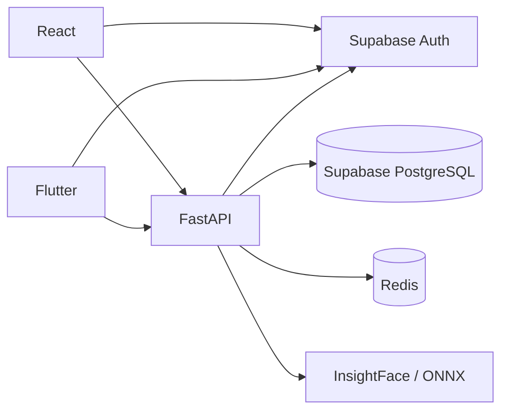
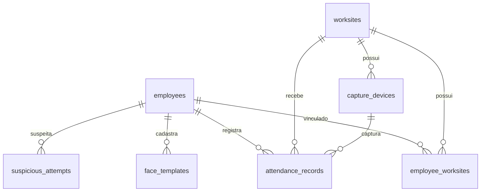

# Diagramas

```mermaid
flowchart LR
  Web[React] --> Auth[Supabase Auth]
  Web --> API[FastAPI]
  Mobile[Flutter] --> Auth
  Mobile --> API
  API --> Auth
  API --> DB[(Supabase PostgreSQL)]
  API --> Redis[(Redis)]
  API --> AI[InsightFace / ONNX]
```

```mermaid
erDiagram
  employees ||--o{ employee_worksites : vinculado
  worksites ||--o{ employee_worksites : possui
  worksites ||--o{ capture_devices : possui
  employees ||--o{ face_templates : cadastra
  employees ||--o{ attendance_records : registra
  worksites ||--o{ attendance_records : recebe
  capture_devices ||--o{ attendance_records : captura
  employees ||--o{ suspicious_attempts : suspeita
```
