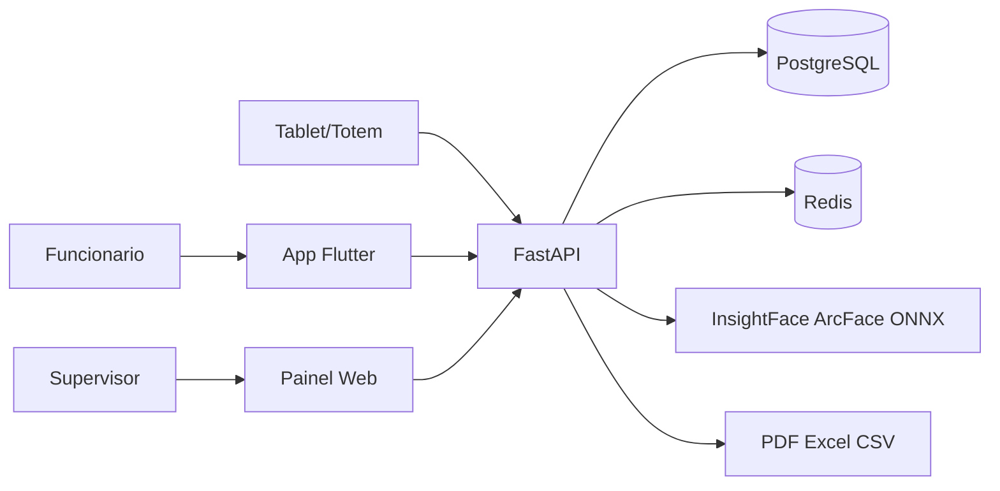
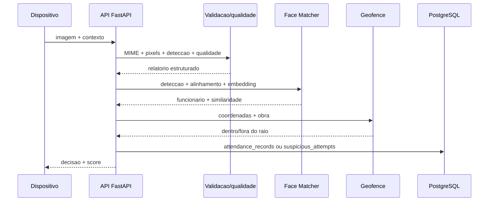
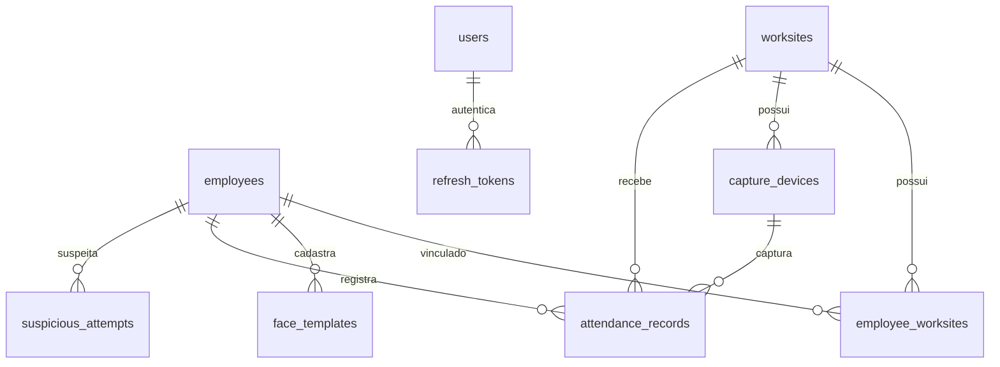

# Diagramas

## Contexto

## Fluxo antifraude

O diagrama ainda não inclui liveness porque challenge-response temporal e PAD não estão
implementados. O endpoint legado de ponto será substituído pelo fluxo de sessão na Sprint 3.

## Entidades principais

